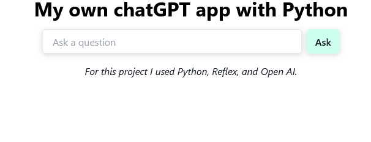

# ChatGPT web app with Python and Reflex

In this project I use a web development framework for Python called Reflex (https://reflex.dev/).

This framework allows you to write the project using Python, and builds everything necessary for its operation, using node, react, css, and a very current stack of tools and technologies. 

## Introduction 🚀

Reflex is an open-source, full-stack Python framework that makes it easy to build and deploy web apps in minutes. 

web_python_reflex
├── .web
├── assets
├── web_python_reflex
│   ├── __init__.py
│   ├── state.py
│   ├── style.py
│   └── web_python_reflex.py
└── readme.md
└── requirements.txt
└── rxconfig.py

### Requirements 📋

All project requirements are recorded in requirements.txt

### Running 🔧

1 -Copy the project to your own home directory
2 -Set your .env variables (the only ones you need is "API_KEY" for OpenAI api consumption)
3 -activate the environment "my-env"
4 -In your console, run the following command: reflex run
5 -Go to https://localhost:3000/

## Build with 🛠️

* [Reflex](https://reflex.dev/) - Build web apps in minutes. Deploy with a single command.
* [Python](https://www.python.org/) - 
* [OpenAI](https://openai.com/) - OpenAI is an AI research and deployment company. Our mission is to ensure that artificial general intelligence benefits all of humanity.

## Author ✒️

* **Germán Neironi** - - [gneironi-ar](https://github.com/gneironi-ar)

